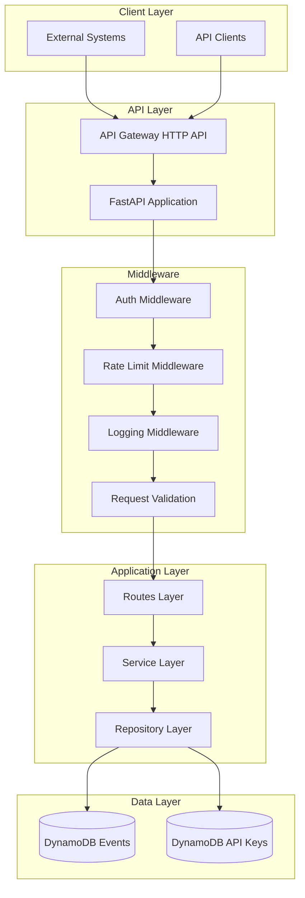
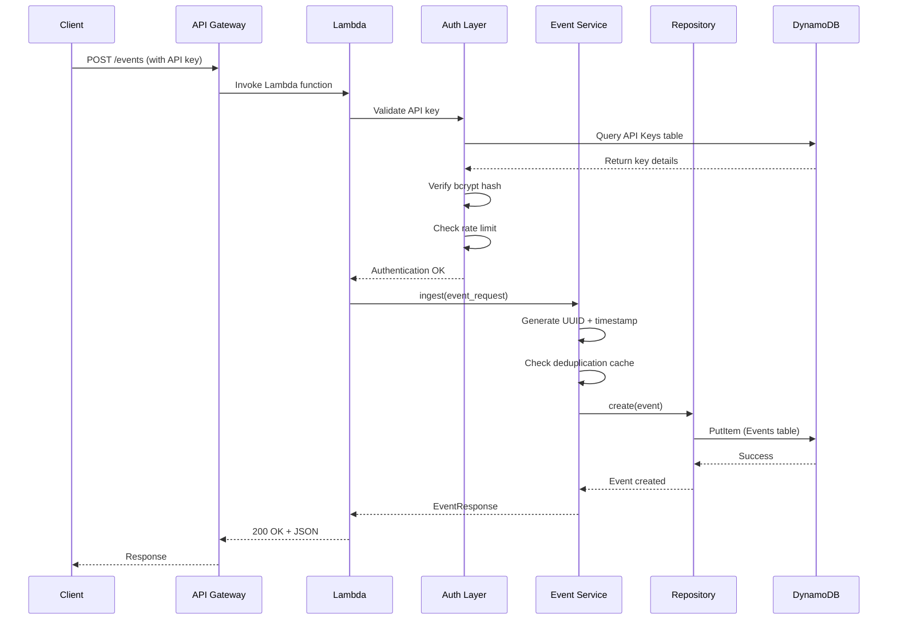
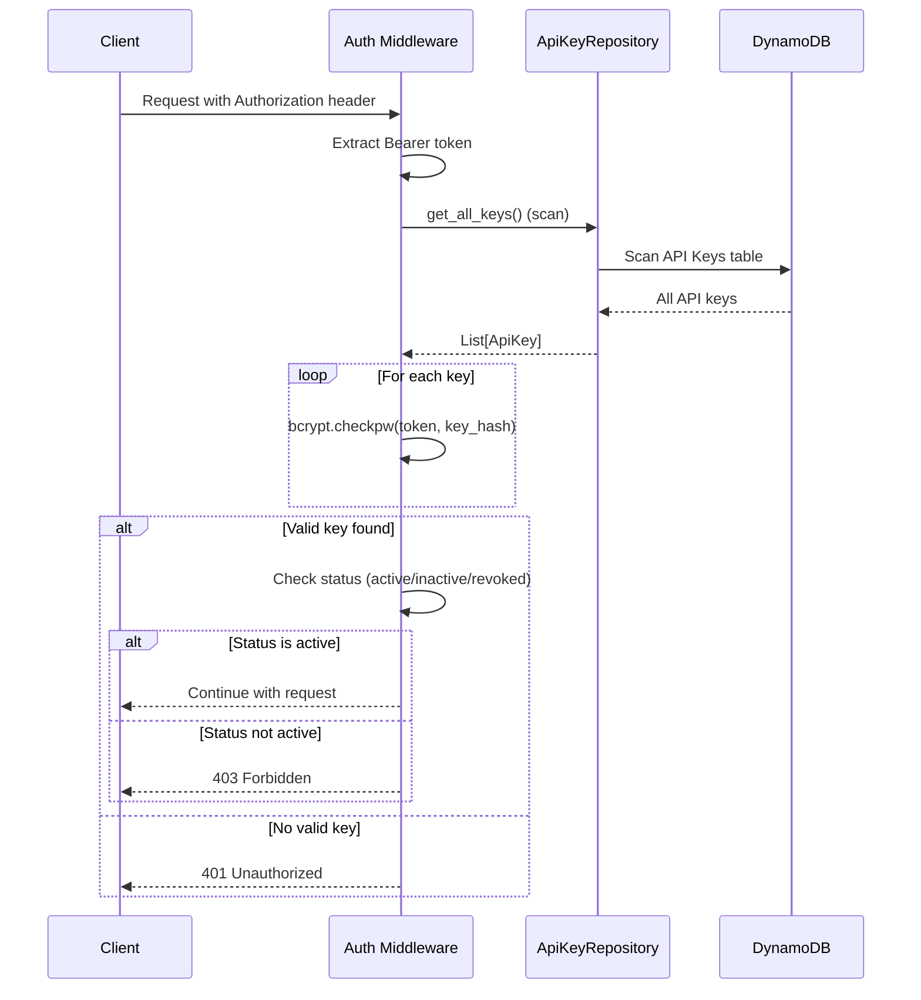
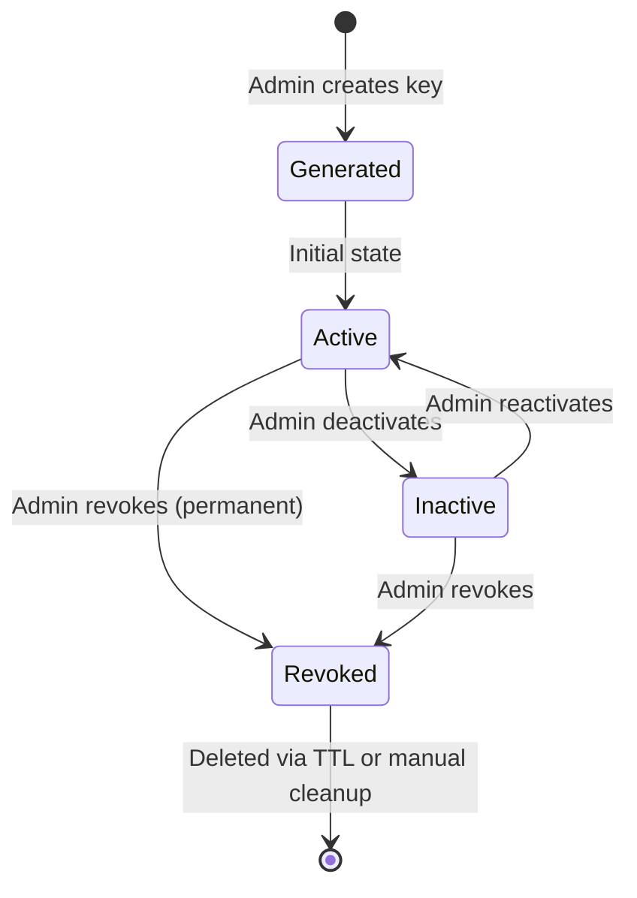
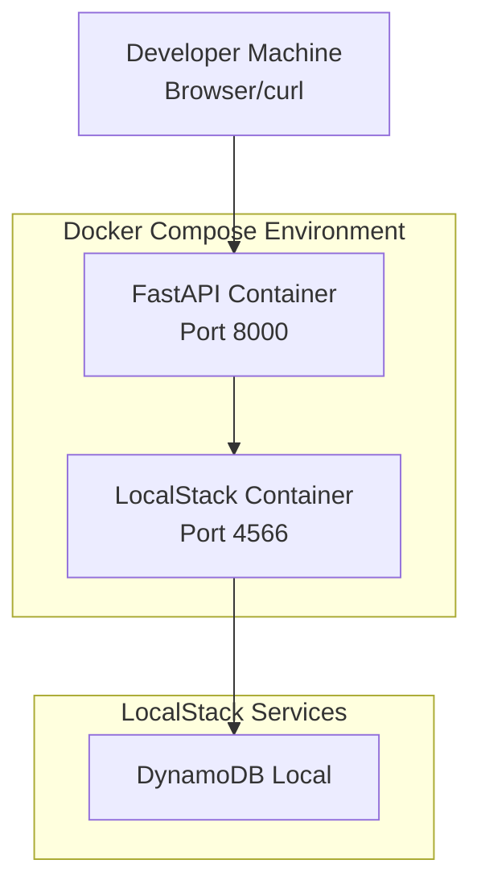
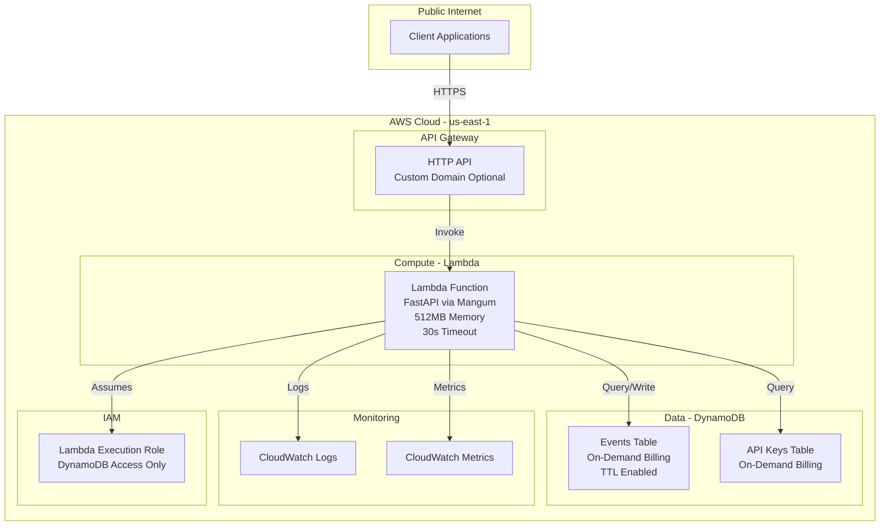

# Architecture Documentation: Zapier Triggers API

**Version:** 1.0
**Last Updated:** 2025-11-11
**Status:** Complete Implementation

---

## Table of Contents

1. [System Overview](#1-system-overview)
2. [Technology Stack](#2-technology-stack)
3. [System Architecture](#3-system-architecture)
4. [Component Architecture](#4-component-architecture)
5. [Data Models](#5-data-models)
6. [Key Subsystems](#6-key-subsystems)
7. [Security Architecture](#7-security-architecture)
8. [Deployment Architecture](#8-deployment-architecture)
9. [Performance Characteristics](#9-performance-characteristics)
10. [Design Decisions](#10-design-decisions)

---

## 1. System Overview

### 1.1 Purpose

The Zapier Triggers API is a unified, event-driven automation system that enables any external system to send events into the Zapier platform via a RESTful API. It provides reliable event ingestion, retrieval, and acknowledgment capabilities with built-in authentication, rate limiting, and deduplication.

### 1.2 Key Features

- **Event Ingestion**: POST events with automatic validation and deduplication (5-minute window)
- **Event Retrieval**: GET undelivered events with cursor-based pagination
- **Event Acknowledgment**: DELETE to mark events as delivered (soft delete)
- **API Key Authentication**: Secure bearer token authentication with bcrypt hashing
- **Rate Limiting**: Per-API-key rate limits (default: 100 requests/minute)
- **Local Development**: Docker + LocalStack for AWS-free local development
- **AWS Deployment**: Lambda + API Gateway + DynamoDB deployment ready

### 1.3 High-Level Data Flow

```
Client Application
       |
       | 1. HTTP Request (with API key)
       v
   API Gateway
       |
       | 2. Route to Lambda
       v
  Lambda (FastAPI)
       |
       ├── 3a. Authenticate (API Key validation)
       ├── 3b. Rate Limit Check
       ├── 3c. Business Logic (Event Service)
       └── 3d. Data Persistence
           |
           v
       DynamoDB
       (Events + API Keys tables)
```

---

## 2. Technology Stack

### 2.1 Core Technologies

| Component | Technology | Version | Purpose |
|-----------|-----------|---------|---------|
| **Language** | Python | 3.11+ | Application logic |
| **Web Framework** | FastAPI | Latest | Async REST API with auto-docs |
| **Database** | Amazon DynamoDB | N/A | Serverless NoSQL storage |
| **Authentication** | bcrypt | Latest | API key hashing |
| **Async Runtime** | asyncio | Built-in | Non-blocking I/O |
| **AWS SDK** | aioboto3 | Latest | Async DynamoDB operations |

### 2.2 Development Tools

| Tool | Purpose |
|------|---------|
| **black** | Code formatting |
| **ruff** | Fast linting |
| **mypy** | Static type checking |
| **pytest** | Unit & integration testing |
| **pre-commit** | Git hooks automation |

### 2.3 Infrastructure

| Component | Technology | Purpose |
|-----------|-----------|---------|
| **Containerization** | Docker | Local development environment |
| **Orchestration** | docker-compose | Multi-container setup |
| **AWS Emulation** | LocalStack | Local DynamoDB emulation |
| **Serverless** | AWS Lambda | Stateless compute |
| **API Gateway** | HTTP API | Public API endpoint |
| **IaC** | CloudFormation | Infrastructure provisioning |

---

## 3. System Architecture

### 3.1 System Architecture Diagram



### 3.2 Request Flow



### 3.3 Integration Points

| Source | Target | Protocol | Purpose |
|--------|--------|----------|---------|
| API Gateway | Lambda | AWS_PROXY | HTTP request forwarding |
| Lambda | DynamoDB | HTTPS | Data persistence & retrieval |
| Client | API Gateway | HTTPS | REST API calls |
| Lambda | CloudWatch | AWS API | Logs & metrics |

---

## 4. Component Architecture

### 4.1 Layered Architecture

The application follows a strict layered architecture pattern:

```
┌─────────────────────────────────────┐
│     Routes Layer (API Endpoints)    │  ← FastAPI routers, request/response
├─────────────────────────────────────┤
│     Service Layer (Business Logic)  │  ← Orchestration, validation, rules
├─────────────────────────────────────┤
│  Repository Layer (Data Access)     │  ← DynamoDB CRUD operations
├─────────────────────────────────────┤
│      Models Layer (Data Types)      │  ← Pydantic models, type definitions
└─────────────────────────────────────┘
```

**Key Principles:**
- **Unidirectional Dependencies**: Upper layers depend on lower layers only
- **Separation of Concerns**: Each layer has a single, well-defined responsibility
- **Testability**: Layers can be tested independently via dependency injection
- **Type Safety**: Type hints enforced across all layers

### 4.2 Package Organization

```
src/
├── __init__.py
├── main.py                    # FastAPI app entry point
├── config.py                  # Pydantic Settings configuration
├── exceptions.py              # Custom exception classes
├── lambda_handler.py          # Lambda entry point (Mangum adapter)
│
├── models/                    # Pydantic data models
│   ├── event.py              # Event model
│   └── api_key.py            # ApiKey model
│
├── schemas/                   # API request/response schemas
│   └── event.py              # CreateEventRequest, EventResponse, etc.
│
├── repositories/              # Data access layer
│   ├── base.py               # BaseRepository (CRUD operations)
│   ├── event_repository.py   # EventRepository
│   └── api_key_repository.py # ApiKeyRepository
│
├── services/                  # Business logic layer
│   └── event_service.py      # EventService (orchestration)
│
├── routes/                    # API endpoints
│   ├── events.py             # Event CRUD routes
│   └── status.py             # Health check route
│
├── auth/                      # Authentication
│   ├── api_key.py            # API key hashing/verification
│   └── dependencies.py       # FastAPI auth dependencies
│
├── middleware/                # Request/response middleware
│   ├── rate_limit.py         # Rate limiting
│   ├── logging.py            # Structured logging
│   └── request_validation.py # Request size validation
│
├── handlers/                  # Exception handlers
│   └── exception_handler.py  # Global error handling
│
├── logging/                   # Logging configuration
│   └── config.py             # JSONFormatter setup
│
└── utils/                     # Utilities
    └── deduplication.py      # Deduplication cache
```

### 4.3 Key Classes and Responsibilities

#### 4.3.1 Models (`src/models/`)

**Event** (`event.py`):
```python
class Event(BaseModel):
    """Event model representing an ingested event."""
    event_id: str          # UUID partition key
    timestamp: str         # ISO 8601 sort key
    event_type: str        # Event category
    payload: dict[str, Any]  # Arbitrary JSON
    source: str | None     # Optional source identifier
    metadata: dict[str, Any] | None
    delivered: bool        # Delivery status
    created_at: str       # ISO 8601
    updated_at: str       # ISO 8601
    ttl: int | None       # Unix timestamp for DynamoDB TTL
```

**ApiKey** (`api_key.py`):
```python
class ApiKey(BaseModel):
    """API Key model for authentication."""
    key_id: str                    # UUID
    key_hash: str                  # bcrypt hash
    status: str                    # active, inactive, revoked
    rate_limit: int                # Requests per minute
    allowed_event_types: list[str] | None
    created_at: str
    last_used_at: str | None
    description: str | None
```

#### 4.3.2 Repositories (`src/repositories/`)

**BaseRepository** (`base.py`):
- Provides common DynamoDB operations: `put_item`, `get_item`, `update_item`, `delete_item`
- Uses `aioboto3` for async context managers
- All methods are async and use proper resource cleanup

**EventRepository** (`event_repository.py`):
- `create(event)` - Store new event
- `get_by_id(event_id, timestamp)` - Retrieve specific event
- `list_undelivered(limit, cursor)` - Query undelivered events via GSI
- `mark_delivered(event_id, timestamp)` - Soft delete with TTL

**ApiKeyRepository** (`api_key_repository.py`):
- `get_by_id(key_id)` - Retrieve key by ID
- `get_by_key_hash(key_hash)` - Find key by hash (for authentication)
- `create(api_key)` - Store new key

#### 4.3.3 Services (`src/services/`)

**EventService** (`event_service.py`):
- `ingest(request)` - Generate ID, deduplicate, persist event
- `get(event_id, timestamp)` - Retrieve event details
- `list_inbox(limit, cursor)` - Paginate undelivered events
- `mark_delivered(event_id, timestamp)` - Mark event as consumed

**Design Pattern**: Service Orchestration
- Coordinates between repositories and utilities
- Implements business logic (deduplication, validation)
- Returns API-friendly schemas (not raw models)

#### 4.3.4 Routes (`src/routes/`)

**Events Router** (`events.py`):
- `POST /events` - Ingest new event (requires auth)
- `GET /events/inbox` - List undelivered events with pagination
- `GET /events/{event_id}` - Retrieve specific event
- `DELETE /events/{event_id}` - Mark event as delivered

**Status Router** (`status.py`):
- `GET /status` - Health check (no auth required)

**Design Pattern**: Thin Controllers
- Routes handle HTTP concerns only (request/response)
- Delegate business logic to services
- Use FastAPI dependencies for auth and validation

### 4.4 Dependency Injection Pattern

FastAPI's `Depends()` mechanism provides clean dependency injection:

```python
# Authentication dependency
async def require_api_key(
    authorization: str = Header(...)
) -> ApiKey:
    """Extract and validate API key from Authorization header."""
    # ... validation logic ...
    return api_key

# Usage in route
@router.post("/events")
async def create_event(
    event_request: CreateEventRequest,
    api_key: ApiKey = Depends(require_api_key)  # Injected automatically
) -> EventResponse:
    # api_key is validated and available here
    pass
```

**Benefits:**
- Testable: Can inject mock dependencies in tests
- Reusable: Same dependency used across all protected routes
- Clear: Explicit about route requirements

---

## 5. Data Models

### 5.1 DynamoDB Table Schemas

#### 5.1.1 Events Table

**Table Name**: `zapier-events` (configurable)

| Attribute | Type | Description | Key Type |
|-----------|------|-------------|----------|
| `event_id` | String (UUID) | Unique event identifier | Partition Key |
| `timestamp` | String (ISO 8601) | Event creation time | Sort Key |
| `event_type` | String | Event category (max 255 chars) | - |
| `payload` | Map | Arbitrary JSON (max 256KB) | - |
| `source` | String | Optional source identifier | - |
| `metadata` | Map | Optional additional metadata | - |
| `delivered` | Number (0/1) | Delivery status (0=false, 1=true) | GSI Partition Key |
| `created_at` | String (ISO 8601) | Record creation time | - |
| `updated_at` | String (ISO 8601) | Last update time | - |
| `ttl` | Number (Unix timestamp) | TTL for automatic deletion | - |

**Global Secondary Index**: `DeliveredIndex`
- Partition Key: `delivered` (Number: 0 or 1)
- Sort Key: `timestamp` (String)
- Projection: ALL
- Purpose: Efficient queries for undelivered events (delivered=0)

**Why delivered is Number instead of Boolean:**
DynamoDB GSI requires a consistent type across all items. Boolean attributes don't have a single type representation in DynamoDB (can be BOOL or NULL), causing GSI issues. Using Number (0=false, 1=true) ensures all items can be indexed.

**TTL Configuration:**
- Attribute: `ttl`
- Purpose: Automatic deletion of delivered events after 30 days (configurable)
- Deletion: Within 48 hours of TTL expiration (DynamoDB guarantee)

#### 5.1.2 API Keys Table

**Table Name**: `zapier-api-keys` (configurable)

| Attribute | Type | Description | Key Type |
|-----------|------|-------------|----------|
| `key_id` | String (UUID) | Unique key identifier | Partition Key |
| `key_hash` | String | bcrypt hash of API key | - |
| `status` | String | active, inactive, or revoked | - |
| `rate_limit` | Number | Requests per minute | - |
| `allowed_event_types` | List | Optional event type whitelist | - |
| `created_at` | String (ISO 8601) | Key creation time | - |
| `last_used_at` | String (ISO 8601) | Last authentication time | - |
| `description` | String | Human-readable description | - |

**Note**: No GSI needed for MVP. API key lookup uses scan (acceptable for small key counts). For production at scale, add GSI on `key_hash` for O(1) lookup.

### 5.2 API Request/Response Schemas

#### 5.2.1 POST /events Request

```json
{
  "event_type": "string (required, 1-255 chars)",
  "payload": {
    "arbitrary": "json object (required, max 256KB)"
  },
  "source": "string (optional)",
  "metadata": {
    "additional": "metadata (optional)"
  }
}
```

#### 5.2.2 POST /events Response

```json
{
  "status": "accepted",
  "event_id": "550e8400-e29b-41d4-a716-446655440000",
  "timestamp": "2025-11-11T12:00:00Z",
  "message": "Event successfully ingested"
}
```

#### 5.2.3 GET /events/inbox Response

```json
{
  "events": [
    {
      "event_id": "uuid",
      "event_type": "string",
      "payload": {},
      "timestamp": "ISO 8601",
      "source": "string"
    }
  ],
  "pagination": {
    "next_cursor": "base64-encoded-cursor or null",
    "has_more": false,
    "total_undelivered": 10
  }
}
```

### 5.3 Data Validation

**Pydantic Models** provide automatic validation:
- Type checking (string, int, dict, etc.)
- Range validation (min/max length, value ranges)
- Required vs. optional fields
- Custom validators for business rules

Example validation in `CreateEventRequest`:
```python
class CreateEventRequest(BaseModel):
    event_type: str = Field(..., min_length=1, max_length=255)
    payload: dict[str, Any]  # Validated for JSON serialization
    source: str | None = None
    metadata: dict[str, Any] | None = None

    @validator("payload")
    def validate_payload_size(cls, v):
        # Check payload size < 256KB
        size = len(json.dumps(v).encode("utf-8"))
        if size > 256 * 1024:
            raise ValueError("Payload exceeds 256KB")
        return v
```

---

## 6. Key Subsystems

### 6.1 Authentication Flow



**Implementation Details** (`src/auth/dependencies.py`):
1. Extract `Authorization: Bearer <token>` header
2. Scan all API keys from DynamoDB (O(n) operation)
3. For each key, verify bcrypt hash with `bcrypt.checkpw()`
4. If match found, check status (must be "active")
5. Return `ApiKey` model for downstream use

**Performance Note**: O(n) scan is acceptable for MVP with small key counts. For production at scale, implement:
- GSI on `key_hash` for O(1) lookup
- In-memory caching with TTL for frequently used keys

### 6.2 Rate Limiting

**Implementation** (`src/middleware/rate_limit.py`):

```python
class RateLimiter:
    """In-memory rate limiter with sliding window."""

    def __init__(self):
        self._requests: dict[str, list[float]] = {}

    def check_rate_limit(self, key_id: str, limit: int) -> None:
        """
        Check if API key has exceeded rate limit.

        Args:
            key_id: API key identifier
            limit: Requests per minute

        Raises:
            RateLimitError: If limit exceeded
        """
        now = time.time()
        window_start = now - 60  # 60-second sliding window

        # Get request timestamps for this key
        if key_id not in self._requests:
            self._requests[key_id] = []

        # Remove timestamps outside window
        self._requests[key_id] = [
            ts for ts in self._requests[key_id]
            if ts > window_start
        ]

        # Check if limit exceeded
        if len(self._requests[key_id]) >= limit:
            retry_after = 60 - (now - self._requests[key_id][0])
            raise RateLimitError(
                message="Rate limit exceeded",
                retry_after=int(retry_after)
            )

        # Record this request
        self._requests[key_id].append(now)
```

**Characteristics:**
- **Algorithm**: Sliding window (60-second window)
- **Storage**: In-memory dictionary (not distributed)
- **Granularity**: Per API key
- **Reset**: Automatic (timestamps outside window are removed)

**Limitations** (acceptable for MVP):
- Not distributed across Lambda instances
- Lost on Lambda cold start
- No persistence across deployments

**Production Recommendations**:
- Use Redis for distributed rate limiting
- Implement token bucket algorithm for burst handling
- Add per-endpoint granularity if needed

### 6.3 Event Deduplication

**Implementation** (`src/utils/deduplication.py`):

```python
class DeduplicationCache:
    """In-memory deduplication cache with TTL."""

    def __init__(self, window_seconds: int = 300):
        self.window_seconds = window_seconds
        self._cache: dict[str, tuple[str, float]] = {}

    def _create_fingerprint(self, event_type: str, payload: dict) -> str:
        """Create SHA256 fingerprint of event."""
        content = json.dumps({"type": event_type, "data": payload}, sort_keys=True)
        return hashlib.sha256(content.encode()).hexdigest()

    def check_and_add(
        self, event_type: str, payload: dict, event_id: str
    ) -> str | None:
        """
        Check if event is duplicate and add to cache.

        Returns:
            Existing event_id if duplicate, None if new event
        """
        fingerprint = self._create_fingerprint(event_type, payload)
        now = time.time()

        # Clean expired entries
        self._cleanup_expired(now)

        # Check for duplicate
        if fingerprint in self._cache:
            existing_id, _ = self._cache[fingerprint]
            return existing_id

        # Add to cache
        self._cache[fingerprint] = (event_id, now)
        return None
```

**Key Features:**
- **Window**: 5 minutes (300 seconds, configurable)
- **Fingerprint**: SHA256 hash of `event_type` + `payload` (sorted JSON)
- **Cleanup**: Periodic removal of expired entries
- **Return**: Original `event_id` if duplicate detected

**Duplicate Handling**:
When duplicate detected, client receives same response as original:
```json
{
  "status": "accepted",
  "event_id": "original-uuid",  // Same as first submission
  "timestamp": "current-time",
  "message": "Event successfully ingested (duplicate detected)"
}
```

**Current Limitation** (known issue in `progress.md`):
- New `DeduplicationCache` instance created per request
- Cache not shared across requests in current implementation
- Fix: Use module-level singleton or FastAPI dependency injection

**Production Recommendations**:
- Use Redis for distributed deduplication
- Extend window as needed (5-60 minutes typical)
- Consider idempotency keys for client-driven deduplication

### 6.4 Event Retrieval with Pagination

**Cursor-Based Pagination** (`src/services/event_service.py`):

```python
async def list_inbox(
    self, limit: int = 50, cursor: str | None = None
) -> InboxResponse:
    """List undelivered events with pagination."""

    # Decode cursor to DynamoDB LastEvaluatedKey
    last_key = None
    if cursor:
        try:
            decoded = base64.b64decode(cursor)
            last_key = json.loads(decoded)
        except Exception:
            raise ValidationError("Invalid cursor")

    # Query DynamoDB via repository
    events, next_key = await self.repository.list_undelivered(
        limit=limit,
        last_evaluated_key=last_key
    )

    # Encode next cursor
    next_cursor = None
    if next_key:
        cursor_json = json.dumps(next_key, sort_keys=True)
        next_cursor = base64.b64encode(cursor_json.encode()).decode()

    return InboxResponse(
        events=[...],
        pagination=PaginationMetadata(
            next_cursor=next_cursor,
            has_more=next_key is not None,
            total_undelivered=len(events)  # Note: Approximate
        )
    )
```

**Implementation Details:**
- **Cursor Format**: Base64-encoded JSON of DynamoDB `LastEvaluatedKey`
- **Opaque**: Clients treat cursor as opaque string
- **Stateless**: No server-side pagination state
- **Order**: Chronological (oldest first) via GSI sort key

**DynamoDB Query** (`src/repositories/event_repository.py`):
```python
query_params = {
    "IndexName": "DeliveredIndex",
    "KeyConditionExpression": "delivered = :delivered",
    "ExpressionAttributeValues": {":delivered": 0},
    "Limit": limit,
    "ScanIndexForward": True,  # Chronological order
    "ExclusiveStartKey": last_evaluated_key  # Pagination cursor
}
```

**Pagination Flow:**
1. Client: `GET /events/inbox?limit=50` (first page)
2. Server: Query DynamoDB with limit=50
3. Server: Return events + `next_cursor` (if more results)
4. Client: `GET /events/inbox?limit=50&cursor=<next_cursor>` (next page)
5. Repeat until `has_more=false`

---

## 7. Security Architecture

### 7.1 Authentication Mechanisms

**API Key Authentication**:
- **Format**: 64-character alphanumeric string (generated with `secrets` module)
- **Storage**: Never stored in plaintext; only bcrypt hash persisted
- **Transmission**: Via `Authorization: Bearer <api_key>` header over HTTPS
- **Validation**: bcrypt comparison against all stored hashes

**Security Properties**:
- **Confidentiality**: Keys never logged or returned in responses
- **Integrity**: bcrypt work factor prevents rainbow table attacks
- **Non-repudiation**: Each key tied to specific `key_id` for audit trails

### 7.2 API Key Lifecycle



**States:**
- **Active**: Can authenticate requests
- **Inactive**: Temporarily disabled (403 response)
- **Revoked**: Permanently disabled (403 response)

### 7.3 Authorization Model

**Current Implementation** (MVP):
- Binary: Authenticated (any valid active key) or not
- No role-based access control (RBAC)
- No resource-level permissions

**Optional Event Type Restrictions**:
```python
class ApiKey:
    allowed_event_types: list[str] | None
```

If set, API key can only create events matching these types. If `None`, all event types allowed.

**Future Enhancements**:
- RBAC: viewer (read-only), creator (write), admin roles
- Resource isolation: API keys scoped to specific workspaces/tenants
- OAuth 2.0 for delegated authorization

### 7.4 Data Security

**Encryption at Rest** (DynamoDB):
- All tables encrypted with AWS KMS
- Configurable CMK or AWS-managed keys
- Encryption automatic and transparent

**Encryption in Transit**:
- HTTPS enforced for all API communication (TLS 1.2+)
- Internal AWS communication encrypted by default

**Secrets Management**:
- Environment variables for configuration (no hardcoded secrets)
- AWS Secrets Manager recommended for production API key storage
- `.env` files excluded from version control

### 7.5 Input Validation

**Defense Against Injection Attacks**:
- Pydantic validates all input types (no SQL injection risk with NoSQL)
- JSON parsing rejects malformed payloads
- Request size limits prevent memory exhaustion (512KB max)

**Payload Size Limits**:
```python
# Enforced in middleware
MAX_REQUEST_SIZE = 512 * 1024   # 512KB total request
MAX_PAYLOAD_SIZE = 256 * 1024   # 256KB event payload
```

**Event Type Validation**:
```python
event_type: str = Field(..., min_length=1, max_length=255)
```

### 7.6 Rate Limiting for DoS Protection

**Per-Key Limits**:
- Default: 100 requests/minute (configurable per key)
- Sliding window algorithm (60-second window)
- 429 Too Many Requests response with `Retry-After` header

**Global Limits** (recommended for production):
- AWS API Gateway throttling: 10,000 requests/second default
- Lambda concurrent execution limits: 1,000 default (can increase)

### 7.7 Security Best Practices

**Implemented**:
- ✅ HTTPS only (no HTTP fallback)
- ✅ API keys hashed with bcrypt
- ✅ Rate limiting per API key
- ✅ Request size validation
- ✅ No sensitive data in logs (API keys excluded)
- ✅ Structured logging with correlation IDs
- ✅ Error messages don't leak implementation details

**Recommended for Production**:
- 🔲 WAF (Web Application Firewall) rules
- 🔲 AWS Secrets Manager for API key management
- 🔲 Rotate API keys periodically
- 🔲 IP whitelisting for administrative endpoints
- 🔲 CloudTrail for audit logging
- 🔲 Automated vulnerability scanning (Snyk, Dependabot)

---

## 8. Deployment Architecture

### 8.1 Local Development Architecture



**Components:**
- **LocalStack**: Emulates AWS services (DynamoDB) locally
- **FastAPI Container**: Runs application with hot-reload
- **Network**: Docker network for inter-container communication

**Startup**:
```bash
docker-compose up
# Creates DynamoDB tables automatically via healthcheck
# API available at http://localhost:8000
# LocalStack at http://localhost:4566
```

### 8.2 AWS Deployment Architecture



**AWS Resources** (created via CloudFormation):

| Resource | Type | Configuration | Purpose |
|----------|------|---------------|---------|
| **API Gateway** | HTTP API | CORS enabled, access logs | Public API endpoint |
| **Lambda Function** | Python 3.11 runtime | 512MB memory, 30s timeout | Application runtime |
| **Events Table** | DynamoDB | On-demand, TTL enabled, GSI | Event storage |
| **API Keys Table** | DynamoDB | On-demand | Authentication |
| **IAM Role** | Execution Role | DynamoDB read/write only | Least-privilege access |
| **CloudWatch Log Group** | Logs | 7-day retention | Application logs |

**Scaling Characteristics**:
- **API Gateway**: Handles millions of requests/second
- **Lambda**: Auto-scales up to 1,000 concurrent executions (default limit)
- **DynamoDB**: On-demand mode auto-scales read/write capacity
- **Cost**: Pay-per-request (no idle costs)

### 8.3 Deployment Process

**CloudFormation Stacks**:

1. **DynamoDB Stack** (`infrastructure/cloudformation/dynamodb.yaml`):
   - Creates Events and API Keys tables
   - Configures TTL, encryption, backups
   - Exports table names/ARNs for other stacks

2. **API Stack** (`infrastructure/cloudformation/api.yaml`):
   - Creates Lambda function, API Gateway, IAM role
   - Imports DynamoDB table references
   - Configures environment variables

**Deployment Steps**:
```bash
# 1. Build Lambda package
pip install -r requirements-lambda.txt -t build/lambda
cp -r src build/lambda/
cd build/lambda && zip -r ../deployment.zip .

# 2. Upload to S3
aws s3 cp build/deployment.zip s3://bucket/lambda.zip

# 3. Deploy DynamoDB stack
aws cloudformation create-stack \
  --stack-name zapier-triggers-db \
  --template-body file://infrastructure/cloudformation/dynamodb.yaml

# 4. Deploy API stack (after DB stack completes)
aws cloudformation create-stack \
  --stack-name zapier-triggers-api \
  --template-body file://infrastructure/cloudformation/api.yaml \
  --parameters ParameterKey=LambdaCodeS3Bucket,ParameterValue=bucket \
               ParameterKey=LambdaCodeS3Key,ParameterValue=lambda.zip \
  --capabilities CAPABILITY_IAM
```

**Environment Configuration**:
All settings configurable via CloudFormation parameters:
- Table names
- Lambda memory/timeout
- Log level
- TTL days
- API title/version

### 8.4 Environment Isolation

**Separate Stacks per Environment**:
```bash
# Production
aws cloudformation create-stack --stack-name zapier-triggers-api-prod --parameters EnvironmentName=production

# Staging
aws cloudformation create-stack --stack-name zapier-triggers-api-staging --parameters EnvironmentName=staging

# Development
aws cloudformation create-stack --stack-name zapier-triggers-api-dev --parameters EnvironmentName=development
```

**Naming Convention**:
Resources suffixed with environment name:
- `zapier-events-production`
- `zapier-events-staging`
- `zapier-api-keys-production`

### 8.5 Monitoring and Observability

**CloudWatch Logs**:
- **Application Logs**: Structured JSON with correlation IDs
- **API Gateway Access Logs**: Request/response metadata
- **Retention**: 7 days default (configurable)

**CloudWatch Metrics**:
- Lambda invocations, duration, errors, throttles
- DynamoDB consumed capacity, throttled requests
- API Gateway 4xx, 5xx errors, latency percentiles

**Alarms** (recommended for production):
- Lambda error rate > 5%
- API Gateway 5xx rate > 1%
- DynamoDB throttled requests > 0
- Lambda concurrent executions near limit

**Structured Logging Example**:
```json
{
  "timestamp": "2025-11-11T12:00:00Z",
  "level": "INFO",
  "logger": "src.middleware.logging",
  "message": "Request completed",
  "context": {
    "correlation_id": "550e8400-e29b-41d4-a716-446655440000",
    "method": "POST",
    "path": "/events",
    "status_code": 200,
    "response_time_ms": 42,
    "api_key_id": "660e9500-f39c-52e5-b827-557766551111"
  }
}
```

**Correlation ID Flow**:
1. Client sends `X-Request-ID` header (or auto-generated UUID)
2. Middleware extracts/generates correlation ID
3. All logs for that request include `correlation_id`
4. Error responses include `correlation_id` for support

---

## 9. Performance Characteristics

### 9.1 Latency Targets

| Endpoint | p50 | p95 | p99 | Notes |
|----------|-----|-----|-----|-------|
| **POST /events** | 30ms | 100ms | 150ms | Includes DynamoDB write |
| **GET /events/inbox** | 40ms | 200ms | 300ms | Includes DynamoDB query |
| **GET /events/{id}** | 25ms | 80ms | 120ms | Single DynamoDB GetItem |
| **DELETE /events/{id}** | 30ms | 100ms | 150ms | DynamoDB UpdateItem |
| **GET /status** | 5ms | 10ms | 15ms | No database access |

**Latency Breakdown** (POST /events):
```
Total: ~50-100ms
├── API Gateway: 5-10ms
├── Lambda cold start: 500-2000ms (first request only)
├── Lambda warm invocation: 1-5ms
├── Auth (API key lookup): 20-40ms (O(n) scan)
├── bcrypt verification: 10-30ms
├── Business logic: 2-5ms
└── DynamoDB write: 5-15ms
```

### 9.2 Throughput Capacity

**Current Limits** (can be increased via AWS support):
- **API Gateway**: 10,000 requests/second
- **Lambda Concurrency**: 1,000 concurrent executions
- **DynamoDB**: Unlimited (on-demand mode auto-scales)

**Sustained Throughput**:
- Single Lambda instance: ~50-100 requests/second
- With auto-scaling: 1,000+ requests/second (10-20 Lambda instances)

**Burst Capacity**:
- Lambda can burst to 3,000 concurrent executions initially
- DynamoDB on-demand handles double previous peak automatically

### 9.3 Scalability Characteristics

**Horizontal Scalability**:
- ✅ **Stateless Lambda**: Each invocation independent
- ✅ **DynamoDB**: Auto-scales read/write capacity
- ⚠️ **Rate Limiting**: In-memory (not distributed)
- ⚠️ **Deduplication**: In-memory (not distributed)

**Recommendations for High Scale**:
1. **API Key Lookup**: Add GSI on `key_hash` (O(1) vs. O(n))
2. **Caching**: Cache API keys in memory with TTL
3. **Rate Limiting**: Move to Redis for distributed state
4. **Deduplication**: Move to Redis with TTL
5. **Provisioned Concurrency**: Eliminate cold starts for critical workloads

### 9.4 Bottleneck Analysis

**Current Bottlenecks** (from `docs/performance.md`):

1. **API Key Lookup** (O(n) scan):
   - Impact: 20-40ms per request
   - Fix: Add GSI on `key_hash` → O(1) lookup (5-10ms)
   - ROI: High (2-4x faster authentication)

2. **bcrypt Verification** (10-30ms):
   - Impact: CPU-intensive per request
   - Fix: Cache verified keys in memory (TTL: 60 seconds)
   - ROI: High (10x faster repeated authentications)

3. **Non-Distributed State**:
   - Impact: Limits horizontal scaling
   - Fix: Move to Redis for rate limiting + deduplication
   - ROI: Medium (enables true horizontal scale)

4. **Cold Starts** (500-2000ms):
   - Impact: First request after idle period
   - Fix: Provisioned concurrency (costs $$)
   - ROI: Low for MVP, high for production SLAs

### 9.5 Cost-Performance Trade-offs

**Current Configuration** (optimized for low cost):
- On-demand DynamoDB (pay-per-request)
- Lambda without provisioned concurrency
- No caching (in-memory only)

**Cost**: ~$5-20/month for 1M requests/month

**Production Configuration** (optimized for performance):
- Provisioned DynamoDB capacity (predictable workloads)
- Provisioned Lambda concurrency (eliminate cold starts)
- ElastiCache Redis (distributed state)

**Cost**: ~$200-500/month for 10M requests/month

---

## 10. Design Decisions

### 10.1 Why FastAPI?

**Chosen**: FastAPI
**Alternatives Considered**: Flask, Django, Express.js

**Rationale**:
- ✅ Native async/await support (critical for DynamoDB performance)
- ✅ Auto-generated OpenAPI documentation (`/docs`, `/redoc`)
- ✅ Pydantic integration for request/response validation
- ✅ Type hints enforced at runtime (better DX)
- ✅ High performance (comparable to Node.js/Go)

**Trade-offs**:
- ⚠️ Smaller ecosystem than Flask/Django
- ⚠️ Less mature (released 2018 vs. Flask 2010)

### 10.2 Why DynamoDB?

**Chosen**: Amazon DynamoDB
**Alternatives Considered**: PostgreSQL RDS, MongoDB Atlas, Redis

**Rationale**:
- ✅ Serverless (no server management)
- ✅ Auto-scaling (on-demand mode)
- ✅ Built-in TTL (automatic event cleanup)
- ✅ Global Secondary Indexes (efficient queries)
- ✅ Pay-per-request pricing (cost-effective at low volume)

**Trade-offs**:
- ⚠️ Limited querying (no SQL, no full-text search)
- ⚠️ Eventually consistent reads by default
- ⚠️ Learning curve for data modeling

**Why Not PostgreSQL?**:
- Requires server management (even with RDS)
- Fixed capacity (must provision instances)
- Higher baseline cost ($15-50/month minimum)

**Why Not Redis?**:
- Not durable (requires persistence config)
- Not cost-effective for primary storage
- Better suited for caching layer

### 10.3 Why Layered Architecture?

**Chosen**: Routes → Services → Repositories → DynamoDB
**Alternatives Considered**: Monolithic, Microservices

**Rationale**:
- ✅ Clear separation of concerns (HTTP, business logic, data access)
- ✅ Testable (can mock repositories in service tests)
- ✅ Maintainable (changes localized to single layer)
- ✅ Type-safe (Pydantic models at each boundary)

**Trade-offs**:
- ⚠️ More boilerplate than direct database access
- ⚠️ Overkill for very simple CRUD operations

### 10.4 Why API Key Authentication?

**Chosen**: API key bearer tokens with bcrypt
**Alternatives Considered**: OAuth 2.0, AWS IAM, JWT

**Rationale**:
- ✅ Simple to implement (MVP-friendly)
- ✅ Easy for developers to use (single header)
- ✅ Secure storage (bcrypt hashing)
- ✅ Revocation support (status field)

**Trade-offs**:
- ⚠️ No delegated authorization (vs. OAuth 2.0)
- ⚠️ No token expiration (keys valid until revoked)
- ⚠️ Must be rotated manually

**Why Not OAuth 2.0?**:
- Too complex for MVP
- Requires authorization server
- Requires token refresh flow

**Why Not AWS IAM?**:
- Couples API to AWS ecosystem
- Complex for non-AWS clients
- Harder to test locally

### 10.5 Why In-Memory Rate Limiting?

**Chosen**: In-memory dictionary with sliding window
**Alternatives Considered**: Redis, DynamoDB counters

**Rationale**:
- ✅ Simple to implement (no external dependencies)
- ✅ Fast (no network latency)
- ✅ Acceptable for MVP (single Lambda instance)

**Trade-offs**:
- ⚠️ Not distributed (different Lambda instances have separate state)
- ⚠️ Lost on cold start
- ⚠️ Doesn't scale horizontally

**When to Migrate**:
- When traffic exceeds single Lambda instance capacity
- When rate limit enforcement must be strict
- When deploying to multiple regions

**Recommended Production Approach**:
- Redis with sliding window algorithm
- DynamoDB with conditional writes (requires more complex logic)
- API Gateway usage plans (coarse-grained, AWS-managed)

### 10.6 Why Cursor-Based Pagination?

**Chosen**: Opaque cursor (base64-encoded DynamoDB key)
**Alternatives Considered**: Offset/limit, page numbers

**Rationale**:
- ✅ Works with DynamoDB's pagination model (`LastEvaluatedKey`)
- ✅ Handles concurrent inserts gracefully
- ✅ Efficient (no offset skipping)
- ✅ Stateless (no server-side session)

**Trade-offs**:
- ⚠️ Can't jump to arbitrary page (page 1, 2, 3, ...)
- ⚠️ Cursor becomes invalid if data changes

**Why Not Offset/Limit?**:
- Inefficient for large offsets (must scan all preceding rows)
- Inconsistent with concurrent inserts (duplicate/missing results)
- Not natively supported by DynamoDB

### 10.7 Why Soft Deletes?

**Chosen**: Mark `delivered=true`, delete via TTL
**Alternatives Considered**: Hard delete immediately

**Rationale**:
- ✅ Audit trail (can query delivered events within TTL window)
- ✅ Idempotent (DELETE same event multiple times = 204)
- ✅ Automatic cleanup via DynamoDB TTL (no manual batch delete)

**Trade-offs**:
- ⚠️ Storage costs for delivered events (until TTL expires)
- ⚠️ Delivered events still in table (must filter queries)

**TTL Configuration**:
- Default: 30 days after delivery
- Deletion: Within 48 hours of TTL expiration (DynamoDB guarantee)
- Configurable via `EVENT_TTL_DAYS` environment variable

### 10.8 Why CloudFormation over Terraform?

**Chosen**: CloudFormation
**Alternatives Considered**: Terraform, AWS SAM, Serverless Framework

**Rationale**:
- ✅ Native AWS integration (no third-party dependencies)
- ✅ No state file management (AWS manages state)
- ✅ Free (no Terraform Cloud costs)
- ✅ Well-documented for Lambda/DynamoDB

**Trade-offs**:
- ⚠️ AWS-only (not multi-cloud)
- ⚠️ YAML syntax verbose
- ⚠️ Less flexible than Terraform

**Why Not Terraform?**:
- Requires state file management (S3 + DynamoDB lock table)
- Additional learning curve
- Overkill for single-cloud deployment

**Why Not AWS SAM?**:
- Less control over API Gateway configuration
- Opinionated structure (less flexible)
- Still uses CloudFormation under the hood

---

## Cross-References

**Related Documentation**:
- [Product Requirements (PRD)](./prd.md) - Business requirements and acceptance criteria
- [Deployment Guide](./deployment.md) - Step-by-step AWS deployment instructions
- [Performance Analysis](./performance.md) - Detailed bottleneck analysis and optimization roadmap
- [Task List](./task-list.md) - Implementation history and PR details
- [Memory Bank](./memory/) - Agent implementation notes and lessons learned

**Code References**:
- [FastAPI Application](../src/main.py) - Entry point and middleware configuration
- [Event Repository](../src/repositories/event_repository.py) - DynamoDB operations
- [Event Service](../src/services/event_service.py) - Business logic orchestration
- [Auth Dependencies](../src/auth/dependencies.py) - API key authentication
- [CloudFormation Templates](../infrastructure/cloudformation/) - IaC definitions

---

**Document Version**: 1.0
**Reviewed By**: Blue Agent
**Review Date**: 2025-11-11
**Status**: Complete
